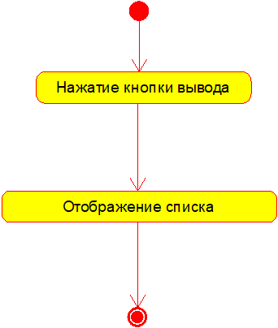
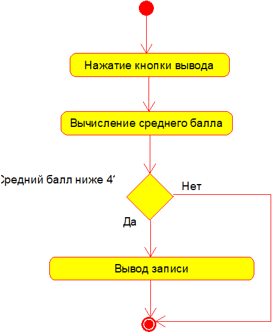
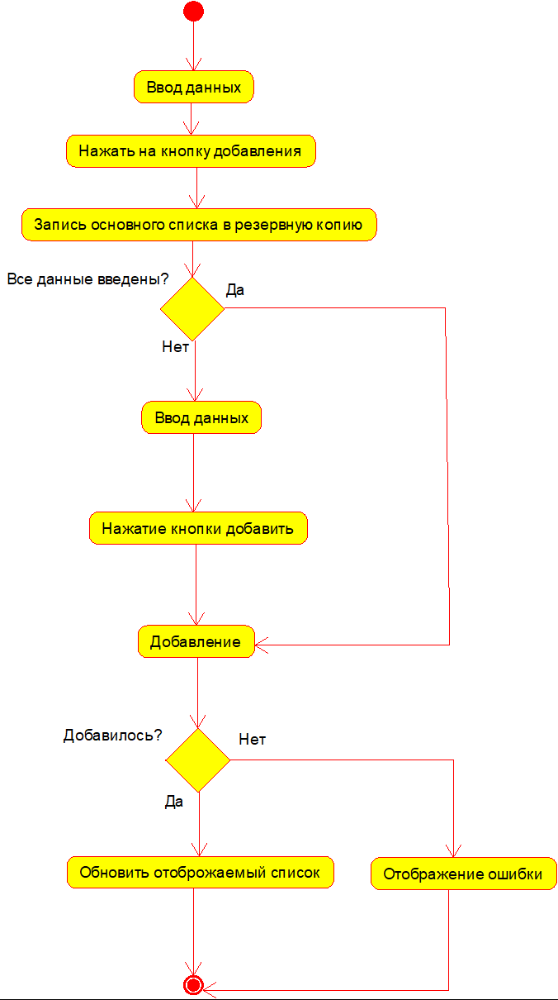
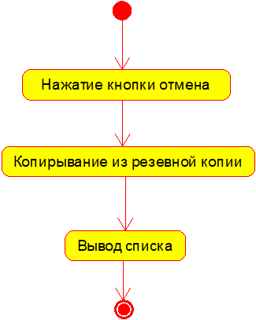
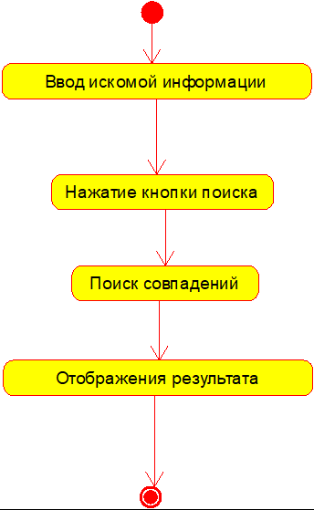
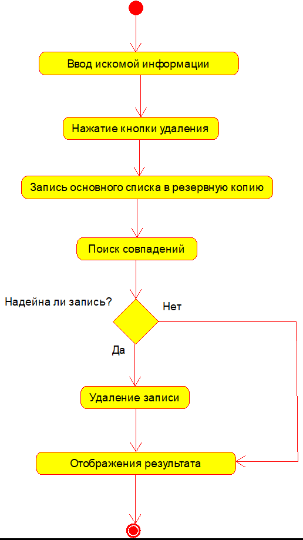

# Диаграммы деятельности

### Вывод всех учеников
---

### Вывод "плохих" учеников
---

### Вывод "хороших" учеников
---

### Добавление
---

### Отмена
---

### Поиск
---

### Редактирование
---

### Удаление
---

